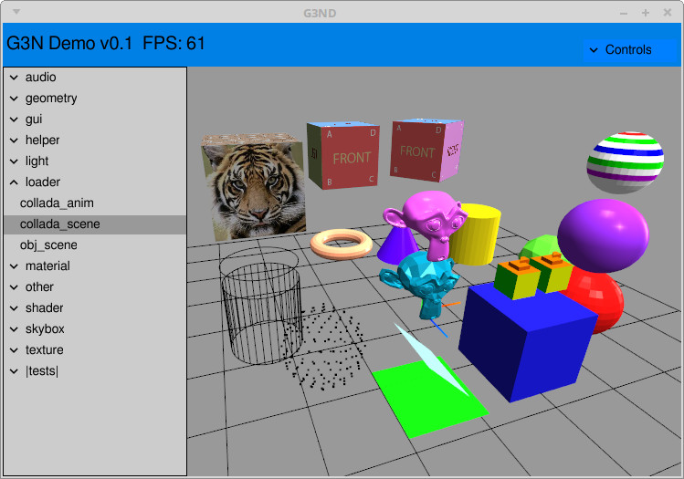

# G3ND - G3N Game Engine Demo Program

G3ND is a demo/test program for the [G3N](https://github.com/g3n/engine) Go 3D Game Engine.
It contains demos of the main features of the engine and also some basic tests.
It can also be used to learn how to use the game engine by examining the source code of the demo programs.
It is very easy to create a new demo as the main program takes care
of a lot of necessary initializations and housekeeping.

<p align="center">
  
</p>

# Dependencies for installation

G3ND imports the [G3N](https://github.com/g3n/engine) game engine and so has the same dependencies as the engine itself.
It needs an OpenGL driver installed in your system and on Unix like systems
depends on some C libraries that can be installed using the platform package manager.
In all cases it is necessary to have a gcc compatible C compiler installed.

* For Ubuntu/Debian-like Linux distributions, install `libgl1-mesa-dev` and `xorg-dev` packages.
* For CentOS/Fedora-like Linux distributions, install `libX11-devel libXcursor-devel libXrandr-devel libXinerama-devel mesa-libGL-devel libXi-devel` packages.
* Currently it was not tested on OS X.
* For Windows we tested the build using the [mingw-w64](https://mingw-w64.org) toolchain.

G3ND checks if audio libraries are installed in the system at runtime
and if found enables the execution of audio demos.
The following libraries are necessary for the audio demos:

* For Ubuntu/Debian-like Linux distributions, install `libopenal1` and `libvorbisfile3`
* For CentOS/Fedora-like Linux distributions, install `libopenal1` and `libvorbisfile3`
* Currently it was not tested on OS X.
* For Windows its is necessary to install the following dlls: `OpenAL32.dll, libogg.dll, libvorbis.dll` and `libvorbisfile.dll`.
  See [windows_audio_dlls](https://github.com/g3n/windows_audio_dlls) for how to get them.

G3ND was only tested with Go1.7.4+.

# Installation

The following command will download G3ND, the engine and all its dependencies, compile and
install the packages and the g3nd binary. Make sure your GOPATH is set correctly.

`go get -u github.com/g3n/g3nd`

Note: G3ND comes with a data directory with media files: images, textures, models and audio files.
Currently this directory has aproximately 50MB. The download and compilation may take some time.
To see what is going on you can alternatively supply the verbose flag:

`go get -u -v github.com/g3n/g3nd`

# Running

When G3ND is run without any command line parameters it shows the tree of
categorized available demos at the left of its window and an empty center area
to show the demo scene.
Click on a category in the tree to expand it and then select a demo to show.

At the upper right corner is located the `Control` folder, which when clicked
shows some controls which can change the parameters of the current demo.

To exit the program press ESC or close the window.

You can start G3ND to show a specific demo specifying the demo name (category plus "." plus name) in the command
line such as:

`>g3nd geometry.box`

To check the maximum FPS rate (frames per second) of your system for any demo,
run G3ND with the option `-interval 0`.
Note that at least one core of your system CPU will run at 100% utilization.
The FPS will be lower when the screen is maximized or full.

# Creating a new demo/test

You can use the `tests_model.go` file as a template
for your tests. You can can change it directly or copy it to a
new file such as `tests_mytest.go` and
experiment with the engine. Your new test will appear under the
`|tests|` category with `mytest` name. The contents of the `tests_model.go`
file are shown below, documenting the common structure of all
demo/tests programs:


```Go
// This is a simple model for your tests
package main

import (
	"github.com/g3n/engine/graphic"
	"github.com/g3n/engine/math32"
)

// Sets the category and name of your test in the global map "TestMap"
// The category name choosen here starts with a "|" so it shows as the
// last category in list. Change "model" to the name of your test.
func init() {
	TestMap["|tests|.model"] = &testsModel{}
}

// This is your test object. You can store state here.
// By convention and to avoid conflict with other demo/tests name it
// using your test category and name.
type testsModel struct {
	grid *graphic.GridHelper    // Pointer to a GridHelper created in 'Initialize'
}

// This method will be called once when the test is selected from the list.
// ctx is a pointer to a Context structure built by the main program.
// It allows access to several important object such as the scene (ctx.Scene),
// camera (ctx.Camera) and the window (ctx.Win) among others.
// You can build your scene adding your objects to the ctx.Scene.
func (t *testsModel) Initialize(ctx *Context) {

	// Show axis helper
	ah := graphic.NewAxisHelper(1.0)
	ctx.Scene.Add(ah)

	// Creates a grid helper and saves its pointer in the test state
	t.grid = graphic.NewGridHelper(50, 1, &math32.Color{0.4, 0.4, 0.4})
	ctx.Scene.Add(t.grid)

	// Changes the camera position
	ctx.Camera.GetCamera().SetPosition(0, 4, 10)
}

// This method will be called at every frame
// You can animate your objects here.
func (t *testsModel) Render(ctx *Context) {

	// Rotate the grid, just for show.
	t.grid.AddRotationY(0.005)
}

```

# Contributing

If you spot a bug or create a new interesting demo you are encouraged to
send pull requests.


